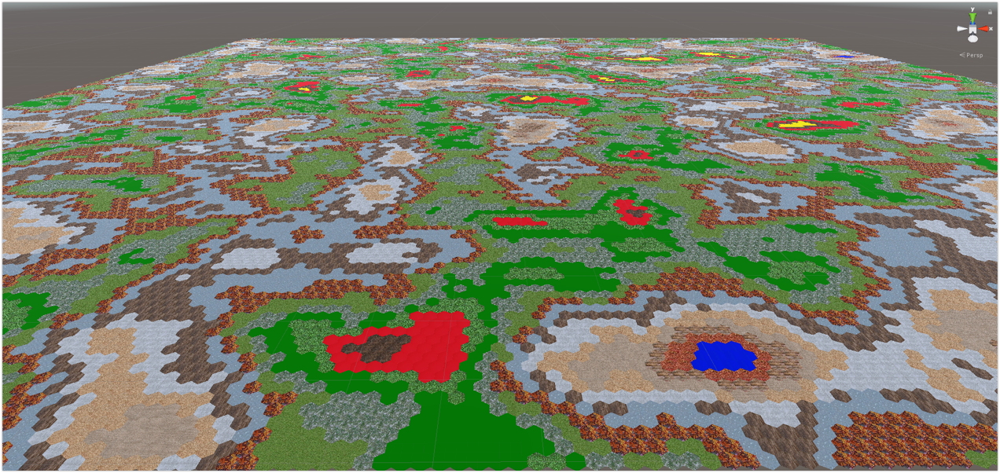

# HexGridGenerator

HexGridGen is modular generator and editor for Unity.
It can create hexagonal boards.
Current features:

* Example of board editor
* Save and load system
* A* Pathfinding
* Line drawing
* Measuring distance

Main generator is split into 3 parts:
* Board positions, and neighbors generator
* Noise generator
* Mesh generator

Project is modular. That means every functionality and generation script can be independently modified and changed.

TODO:
* More advanced noise generator
* Mesh generator using multiple meshes in chunks
* More pathfinding algorithms
* Example scene showcasing and comparing pathfinding algorithms
* Further documentation improvements

Any feedback would be greatly appreciated. Thank you.
